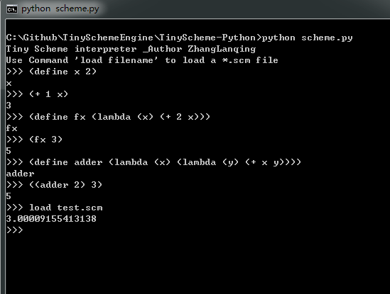

### About

This project is a tiny scheme interpreter implemented with Python3.

### Features

- operators:

```
"+, - * / = > < >= <=". (true divison but floor divison).
```

```
"acos", "acosh", "asin", "asinh", "atan", "atan2", "atanh",
"ceil", "copysign", "cos", "cosh", "degrees", "floor", "log",
"log10", "log1p", "log2", "radians", "sin", "sinh", "sqrt",
"tan", "tanh", "trunc"
```
- specail-forms:

```
"lambda", "define", "if", "cond", "or", "and"
```


### Examples


```
(+ (* 3 (+ (* 2 4) (+ 3 5))) (+ (- 10 7) 6))
Expected: 57
```

```
(define pi 3.14159)
(define radius 10)
(* pi (* radius radius))
Expected: 314.159
```

```
((lambda (x) (+ x 2)) 3)
Expected: 5
```

```
(define adder 
    (lambda (x) (lambda (y) (+ x y))))
((adder 2) 3)
Expected: 5
```

```
(define (abs x)
  (cond ((> x 0) x)
        ((= x 0) 0)
        ((< x 0) (- x))))
(abs -3)
Expected: 3
```

```
(and #t #f)
(or 1 2)
(and 0 1)
Excepted: False, 1, 1. (Only #f is False)
```

```
(define (abs x)
  (cond ((> x 0) x)
        ((= x 0) 0)
        ((< x 0) (- x))))
(define (square x) (* x x))
(define (sqrt-iter guess x)
  (if (good-enough? guess x)
      guess
      (sqrt-iter (improve guess x)
                 x)))
(define (improve guess x)
  (average guess (/ x guess)))
(define (average x y)
  (/ (+ x y) 2))
(define (good-enough? guess x)
  (< (abs (- (square guess) x)) 0.001))
(define (sqrt x)
  (sqrt-iter 1.0 x))
(sqrt 9)
Expected: 3.00009155413138
```




#### TODO:

recently, I'v been working on reimplementing this interpreter with my DIY programming language [**jana**].


